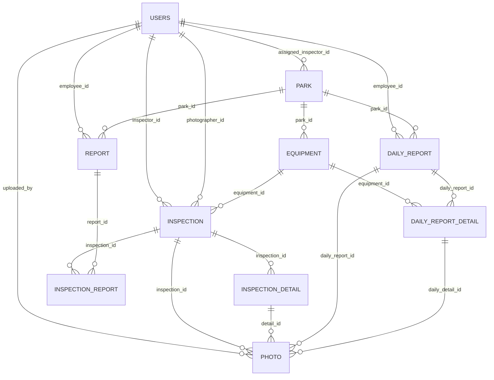

# ER 図：公園遊具安全点検システム

## 概要

```
users（従業員）
  ├─ assigned_parks ────┐
  ├─ created_daily_reports │
  ├─ photographed_inspections │
  ├─ inspected_inspections │
  ├─ created_reports │
  └─ uploaded_photos │
                        ↓
parks（公園）
  ├─ equipments
  ├─ reports
  └─ daily_reports
       ↓
equipments（遊具）
  ├─ inspections ────────┐
  └─ daily_report_details│
                         ↓
inspection（通常点検セッション）
  ├─ details（InspectionDetail）
  ├─ photos（Photo）
  └─ report_links
       ↓
inspection_detail（点検パーツ詳細）
  └─ photos（Photo）
       ↓
photo（写真・統合テーブル）
  ├─ inspection_id →指す
  ├─ daily_report_id →指す
  ├─ detail_id →指す
  ├─ daily_detail_id →指す
  └─ uploaded_by →指す users

daily_reports（日報）
  ├─ details（DailyReportDetail）
  └─ photos（Photo）
       ↓
daily_report_detail（日報の異常記録）
  ├─ equipment_id →指す
  └─ photos（Photo）
       ↓
reports（報告書）
  └─ inspection_links（InspectionReport）
       ↓
inspection_reports（中間テーブル）
  ├─ inspection_id →指す
  └─ report_id →指す
```

---

## 詳細な ER 図（Mermaid 形式）



---

## テーブル定義と主なリレーション

### 1. **users（従業員）**

| カラム      | 型     | 説明                           |
| ----------- | ------ | ------------------------------ |
| employee_id | INT PK | 従業員 ID                      |
| name        | STRING | 名前                           |
| role        | ENUM   | 役職（事務職員/点検者/管理者） |
| password    | STRING | パスワード                     |

**リレーション：**

- ✅ assigned_parks（Park.inspector_id） - 担当公園
- ✅ created_daily_reports（DailyReport.employee_id） - 作成した日報
- ✅ photographed_inspections（Inspection.photographer_id） - 撮影した点検
- ✅ inspected_inspections（Inspection.inspector_id） - 実施した点検
- ✅ created_reports（Report.employee_id） - 作成した報告書
- ✅ uploaded_photos（Photo.uploaded_by） - アップロードした写真

---

### 2. **parks（公園）**

| カラム       | 型     | 説明       |
| ------------ | ------ | ---------- |
| park_id      | INT PK | 公園 ID    |
| park_name    | STRING | 公園名     |
| address      | STRING | 住所       |
| inspector_id | INT FK | 担当検査員 |

**リレーション：**

- ✅ equipments（Equipment.park_id） - 遊具一覧
- ✅ reports（Report.park_id） - 報告書
- ✅ daily_reports（DailyReport.park_id） - 日報
- ⬅️ assigned_inspector（User.inspector_id） - 担当検査員

---

### 3. **equipments（遊具）**

| カラム         | 型     | 説明                   |
| -------------- | ------ | ---------------------- |
| equipment_id   | INT PK | 遊具 ID                |
| park_id        | INT FK | 所属公園               |
| equipment_name | STRING | 遊具名（例：ブランコ） |
| status         | ENUM   | ステータス（A/B/C）    |

**リレーション：**

- ✅ inspections（Inspection.equipment_id） - 点検履歴
- ✅ daily_report_details（DailyReportDetail.equipment_id） - 日報の異常記録

---

### 4. **inspection（通常点検セッション）**

| カラム          | 型       | 説明                |
| --------------- | -------- | ------------------- |
| inspection_id   | INT PK   | 点検 ID             |
| equipment_id    | INT FK   | 検査対象遊具        |
| inspector_id    | INT FK   | 実施検査員          |
| photographer_id | INT FK   | 撮影者              |
| inspection_date | DATETIME | 実施日時            |
| overall_grade   | ENUM     | 総合評価（A/B/C/D） |
| actions_taken   | TEXT     | 実施措置            |

**リレーション：**

- ✅ details（InspectionDetail.inspection_id） - パーツ詳細
- ✅ photos（Photo.inspection_id） - 写真一覧
- ✅ report_links（InspectionReport.inspection_id） - 報告書リンク
- ⬅️ equipment（Equipment.equipment_id） - 検査対象
- ⬅️ inspector（User.inspector_id） - 検査員
- ⬅️ photographer（User.photographer_id） - 撮影者

---

### 5. **inspection_detail（点検パーツ詳細）**

| カラム              | 型     | 説明                            |
| ------------------- | ------ | ------------------------------- |
| detail_id           | INT PK | 詳細 ID                         |
| inspection_id       | INT FK | 所属点検                        |
| part                | ENUM   | パーツ（chain/joint/pole/seat） |
| condition           | ENUM   | 状態（normal/rust/crack）       |
| is_ai_predicted     | BOOL   | AI 判定フラグ                   |
| confidence          | FLOAT  | 予測確信度                      |
| ai_json_detail_data | TEXT   | AI 生データ                     |
| remarks             | TEXT   | 備考                            |

**リレーション：**

- ✅ photos（Photo.detail_id） - 関連写真
- ⬅️ inspection（Inspection.inspection_id） - 親点検

---

### 6. **photo（写真・統合テーブル）**

| カラム          | 型            | 説明                |
| --------------- | ------------- | ------------------- |
| photo_id        | INT PK        | 写真 ID             |
| inspection_id   | INT FK (NULL) | 点検 ID（どちらか） |
| daily_report_id | INT FK (NULL) | 日報 ID（どちらか） |
| detail_id       | INT FK (NULL) | 点検詳細 ID（任意） |
| daily_detail_id | INT FK (NULL) | 日報詳細 ID（任意） |
| file_size       | INT           | ファイルサイズ      |
| photo_data      | BLOB          | 画像バイナリ        |
| uploaded_at     | DATETIME      | アップロード日時    |
| uploaded_by     | INT FK        | アップロード者      |

**リレーション：**

- ✅ inspection（Inspection.inspection_id） - 点検写真
- ✅ daily_report（DailyReport.daily_report_id） - 日報写真
- ✅ uploader（User.uploaded_by） - アップロード者

**特性：**

- 点検と日報の写真を統一管理
- inspection_id と daily_report_id は排他的（どちらか一方）
- detail_id / daily_detail_id は任意

---

### 7. **daily_reports（日報）**

| カラム          | 型       | 説明     |
| --------------- | -------- | -------- |
| daily_report_id | INT PK   | 日報 ID  |
| park_id         | INT FK   | 対象公園 |
| employee_id     | INT FK   | 作成者   |
| report_date     | DATETIME | 報告日時 |
| notes           | TEXT     | 備考     |

**リレーション：**

- ✅ details（DailyReportDetail.daily_report_id） - 異常記録
- ✅ photos（Photo.daily_report_id） - 写真
- ⬅️ park（Park.park_id） - 対象公園
- ⬅️ reporter（User.employee_id） - 作成者

---

### 8. **daily_report_detail（日報の異常記録）**

| カラム               | 型     | 説明                            |
| -------------------- | ------ | ------------------------------- |
| detail_id            | INT PK | 詳細 ID                         |
| daily_report_id      | INT FK | 所属日報                        |
| equipment_id         | INT FK | 対象遊具                        |
| part                 | ENUM   | パーツ（chain/joint/pole/seat） |
| condition            | ENUM   | 異常種類（normal/rust/crack）   |
| deterioration_degree | FLOAT  | 劣化度（0.0-1.0）               |
| remarks              | TEXT   | 備考                            |

**リレーション：**

- ✅ photos（Photo.daily_detail_id） - 関連写真
- ⬅️ daily_report（DailyReport.daily_report_id） - 親日報
- ⬅️ equipment（Equipment.equipment_id） - 対象遊具

---

### 9. **reports（報告書）**

| カラム       | 型       | 説明         |
| ------------ | -------- | ------------ |
| report_id    | INT PK   | 報告書 ID    |
| park_id      | INT FK   | 対象公園     |
| employee_id  | INT FK   | 作成者       |
| created_date | DATETIME | 作成日時     |
| file_url     | STRING   | ファイル URL |
| status       | ENUM     | ステータス   |

**リレーション：**

- ✅ inspection_links（InspectionReport.report_id） - 関連点検
- ⬅️ park（Park.park_id） - 対象公園
- ⬅️ creator（User.employee_id） - 作成者

---

### 10. **inspection_reports（中間テーブル）**

| カラム               | 型       | 説明      |
| -------------------- | -------- | --------- |
| inspection_report_id | INT PK   | ID        |
| inspection_id        | INT FK   | 点検 ID   |
| report_id            | INT FK   | 報告書 ID |
| added_date           | DATETIME | 追加日時  |

**リレーション：**

- ✅ inspection（Inspection.inspection_id） - 点検
- ✅ report（Report.report_id） - 報告書

**特性：**

- 1 つの点検は複数の報告書に含まれる可能性
- 1 つの報告書は複数の点検を参照

---

## リレーションの分類

### **親子関係（1:多）**

```
users → park
users → daily_report
users → inspection
users → report
users → photo

parks → equipment
parks → daily_report
parks → report

equipment → inspection
equipment → daily_report_detail

inspection → inspection_detail
inspection → photo
inspection → inspection_report

daily_report → daily_report_detail
daily_report → photo

inspection_detail → photo
daily_report_detail → photo

report → inspection_report
```

### **外部キー制約（CASCADE）**

```
inspection 削除 → inspection_detail 自動削除
inspection 削除 → photo 自動削除

daily_report 削除 → daily_report_detail 自動削除
daily_report 削除 → photo 自動削除
```

### **排他的リレーション**

```
photo テーブル：
  inspection_id と daily_report_id は排他的（どちらか一方のみNOT NULL）
```

---

## データフロー例

### **通常点検の流れ**

```
1. User（検査員）が Inspection を作成
2. Inspection に複数の InspectionDetail を追加（chain, joint, pole, seat）
3. 各 InspectionDetail に Photo を追加
4. AI判定結果を InspectionDetail に格納
5. Inspection の overall_grade を計算
6. Inspection を Report に含める
```

### **日報の流れ**

```
1. User（スタッフ）が DailyReport を作成
2. DailyReport に複数の DailyReportDetail を追加（異常ごと）
3. 各 DailyReportDetail に Photo を追加
4. deterioration_degree を記録
```

---

## ER 図の ASCII 版

```
┌─────────────┐
│    users    │
├─────────────┤
│ employee_id │ ◄──┐
│ name        │    │
│ role        │    │
│ password    │    │
└─────────────┘    │
       │           │
       ├─────┬─────┼─────────┐
       │     │     │         │
       ▼     ▼     ▼         ▼
    parks  daily  inspect  reports
    reports reports ions
       │     │     │         │
       ▼     ▼     ▼         ▼
    equip   daily  inspect  inspect
    ments   detail details  reports
       │     │     │
       │     ├─────┼─────┐
       │     │     │     │
       ▼     ▼     ▼     ▼
            photos (統合テーブル)
```

この ER 図でシステム全体の構造が把握できます！
